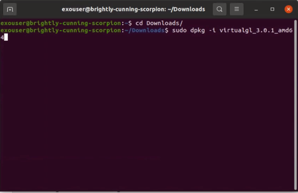
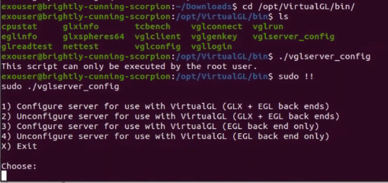
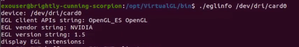
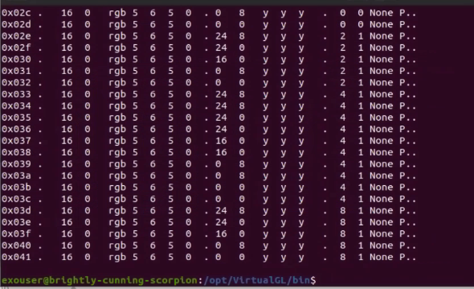
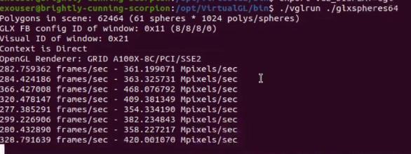
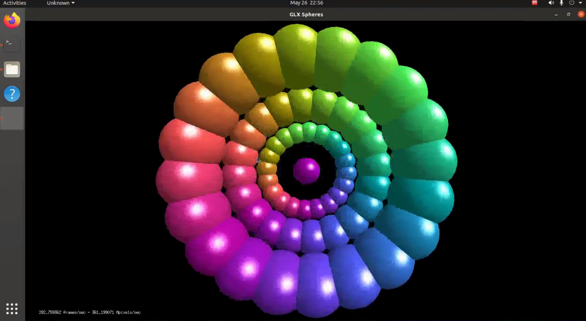
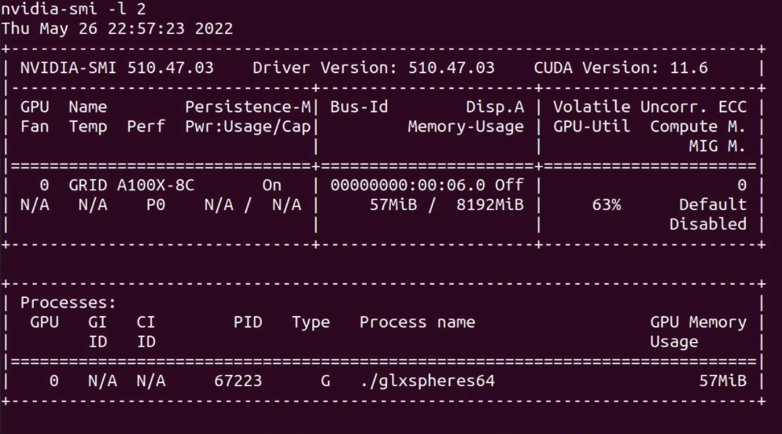
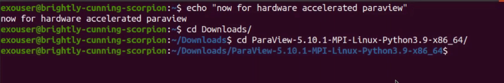
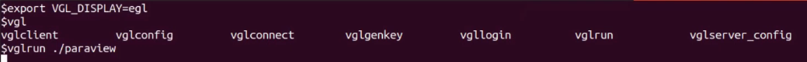
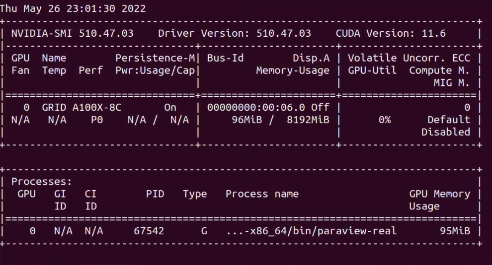

# Jetstream 2 Hardware Accelerated Remote Visualization

This page lays out the steps that are used to make VirtualGL use the Embedded Graphics Library render windows for our visualization on available GPU hardware. This is in contrast to the llvm software renderer that many remote desktop services provide. The result is a much faster way of performing visualization workflows on Jetstream 2 GPU equipped instances.

The format of this document will be fairly heterogenous. The break down of much of the setup will be explained in text with images providing helpful snapshots along the way. In addition to this there will be code snippets to allow you to copy and paste various commands into the jetstream 2 cloud instance's terminal

## Setup 

In this tutorial we will be connecting and running out commands through the [No Machine](https://www.nomachine.com/) remote desktop program. This is by no means the only remote desktop tool that would work with hardware accelerated remote visualizations, but for our purposes it will enable the necessary customization. Further drafts of this page will likely feature alternate programs to demonstrate No Machine is not a concrete dependency. 

For the purposes of this tutorial it is recommended that you create a small GPU instance on JS2. The tutorial also has only been tested with the Ubuntu Flavor of instance, but future work may extend to the centos variety. This will be the only setup that is needed for the JS2 side.  

## Installing No Machine on your local system

For the first step please navigate to [https://www.nomachine.com/](https://www.nomachine.com/) and download the client for your operating system. Once this is complete you will be able to open the No Machine client.

## Making connection with No Machine
The client allows you to add `remote hosts` that you can connect to so we will be using the login information for our JS2 instance when filling out the form for our hardware accelerated host. You will use the ip address for the host ip, the user name by default will be `exouser` and there should be a password specified for login. You will also be prompted to launch a display on the remote host as there likely isn't one created by default. Once you've done this you should be greeted with an ubuntu desktop. 

## Downloading VirtualGL on remote host

The next step requires that you navigate to the VirtualGL source forge website [https://sourceforge.net/projects/virtualgl/](https://sourceforge.net/projects/virtualgl/). Click on the `Files` to view the various release folders, and select the most recent. At the time of writing this was 3.0.1. Inside of this folder are many binary releases for various platforms. We will be clicking on the `virtualgl_3.0.1_amd64.deb` file and downloading it.


## Installing VirtualGL on the remote host from CLI

Now that there is a `.deb` in our downloads folder we must navigate in the terminal to that folder and run the following commands
```
sudo dpkg -i virtualgl_3.0.1._amd64.deb
# if there is a missing dependency run this next
sudo apt install -y --fix-broken
```
The following images show the commands attempted one after another. 




Here there is a missing egl dependency. This can be resolved with a specific install command 


, or we can rely on the `--fix-broken` approach.


Since the `Setting up virtualgl` line is visible in the above output it isn't required but just recommended that the following `dpkg` command gets run again. 
```
sudo dpkg -i virtualgl_3.0.1._amd64.deb
```


## Setting up the VGLServer

Now that the VirtualGL program is installed we can perform the configuration necessary to use the Embedded Graphics Library. First we have to navigate to the binaries under the installation directory for VirtualGL. This is `/opt/VirtualGL/bin` and there we can run the `vglserver_config` script. together the commands are

```
cd /opt/VirtualGL/bin
sudo ./vglserver_config
```




If all is proceeding well the standard output will present a number of options. In this case we aim to use **option 3** as that saves us the hassle of setting up a X server.


The next option is whether we would like to restrict the framebuffer device access to a specific user group. Since we are the only ones accessing this instance it isn't as imperative, but more reading related to this choice can be found here [https://rawcdn.githack.com/VirtualGL/virtualgl/3.0.1/doc/index.html#hd006002](https://rawcdn.githack.com/VirtualGL/virtualgl/3.0.1/doc/index.html#hd006002). We see that there are a few lines of output regarding the update to certain device files that control device permissions. Fear not, the module remaining in use doesn't preclude us from accomplishing this tutorial. The key is to see that write permission has been granted for the `card0` device. 

## Double Checking our configuration settings work

Following the server config it is now possible to check on the `eglinfo` output. This displays information related to a platforms support for EGL and will present errors if our configuration has failed ahead of this point. We have to use the second argument to determine whether a particular device is supported. The code snippet below is sufficient for our task.

```
./eglinfo /dev/dri/card0
```



This will produce a screens worth of information. At the top is information showing specs of the GPU that is configured for hardware acceleration. This is the first bit of solid good news! At the bottom we should see something similar to the following if no errors have crept in. 



## Getting visual confirmation

The next step is when we are able to actually render a window to the No Machine client's view. First it should be mentioned that with basically every hardware accelerated program we must first use the `vglrun` command. This command defaults to trying to render graphical windows using the X server configuration that we chose to ignore back during the `vglserver_config` step. So how do we indicate that we went the EGL route? The solution is either a specific flag for `vglrun` or an environment variable. For this tutorial we will be using the environment variable approach. To read up on the options please consult [https://rawcdn.githack.com/VirtualGL/virtualgl/3.0.1/doc/index.html#hd006004](https://rawcdn.githack.com/VirtualGL/virtualgl/3.0.1/doc/index.html#hd006004). The environment variable can be created with the following snippet

```
export VGL_DISPLAY=egl
```


Now we are able to launch the first graphical program to experience **Hardware Acceleration**. The command we are running is 
```
./vglrun ./glxspheres64
```



This command causes a nice window to appear with rainbow colored spheres spinning around. The numbers to watch are the frames per second down in the bottom left. This program is FLYING at > 300 frames per second. This might be expected when we use a 1/4 of an A100 on such a simple graphical program, but are there other ways to see that the program is indeed using our GPU?



## A top for Nvidia card use

Many nvidia installations on Linux make use of a command `nvidia-smi` to help users determine whether their drivers are successfully installed. This program is also helpful for reporting the utilization of a card in terms of it's power and memory usages. On it's own it will only report the information once, but it is possible to specify a flag to make the program output its logs every couple seconds till we interrupt it. 

```
nvidia-smi -l 2
```

This has the result of outputting the log info every 2 seconds. In the result we are also able to spot which programs are currently listed as using the GPU. Hardware acceleration cannot be said to be underway if a program isn't listed on, but PHEW, our spheres are showing. 




## Testing with something real?

Now that we are assured one program can be used to render itself to the nomachine window with hardware acceleration its time to check on a real program used for visualization, the infamous Paraview. Not shown in the screenshots are the steps take to use the firefox browser to download and uncompress a recent Paraview release, but these steps shouldn't prove too hard for someone who's made it this far in the tutorial. Once the program is all unpacked on the remote host we will navigate to the paraview `/bin` directory.  



Once we are located in the same folder as the `paraview` binary we can setup our environment variable and launch paraview via VirtualGL.
```
export VGL_DISPLAY=egl
vglrun ./paraview
```


If our `nvidia-smi` is still running then it will be possible to check on the name of the program that is using the GPU on the remote host for it's window rendering. 



## Conclusion

This tutorial has shown how to configure a JS2 instance such that is supports hardware accelerated remote visualization workflows. Future work will expand on the programs shown here for making connection to the instance as well as other in depth features on programs like Paraview that stand to benefit from such approaches. For any issues that come up with this workflow please contact the JS2 support ticket system. Thanks for spending your time with this resource and best of luck!
