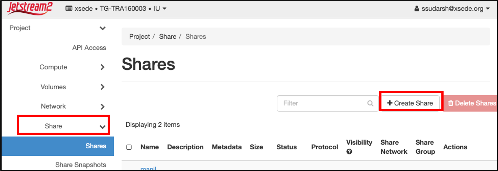
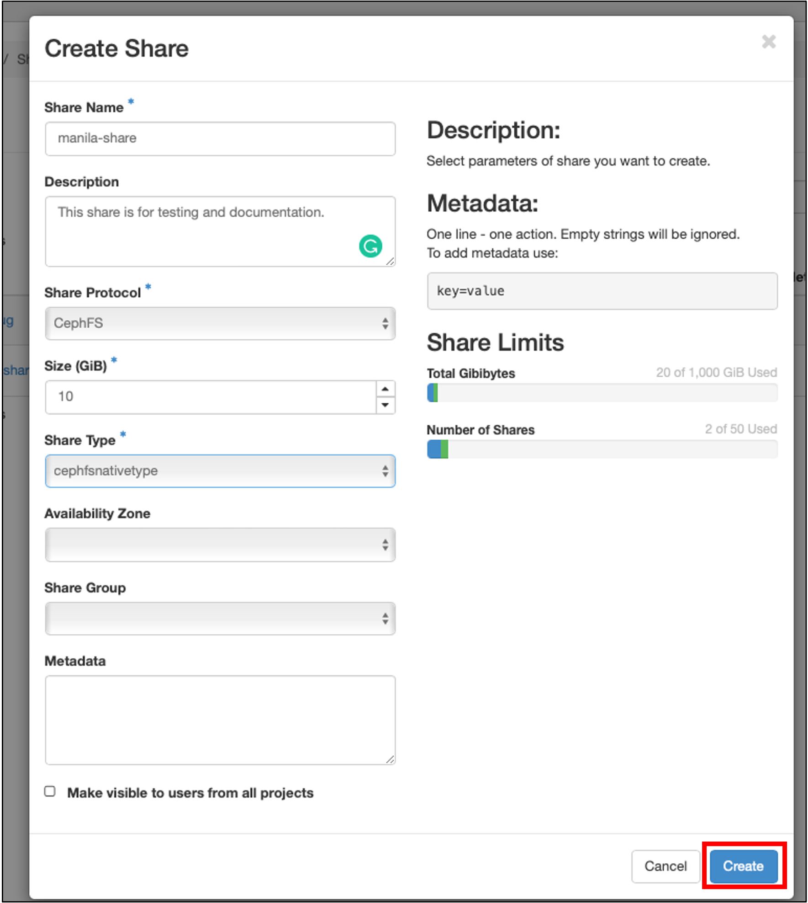
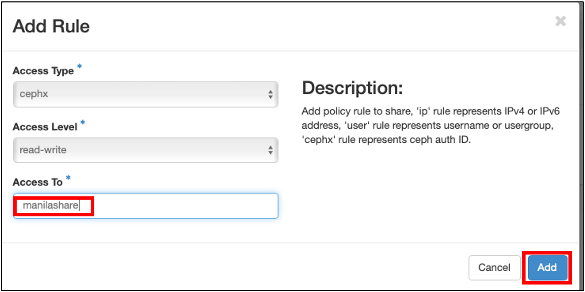

# Manila - Filesystems-as-a-service - on Jetstream2

Manila is the file share service project for OpenStack. Manila provides the management of file shares for example, NFS and CIFS, as a core service to OpenStack. Manila works with a variety of proprietary backend storage arrays and appliances, with open source distributed filesystems, as well as with a base Linux NFS or Samba server.

Prereqs: Make sure you have these packages installed on your instance: ceph-commons and ceph-fuse


## To use Manila via Horizon

### Create the share on Horizon

i. Click on:  Project  → Share → Shares → Create Share <br> 
    
  
&nbsp;  
  
ii. Create a share with the following settings:

    - share name - a name of your choosing  
    - share protocol - CephFS    
    - size - the size of your manila share  
    - share type - cephnfsnativetype  
  
  
&nbsp;  
    
iii. Once your share is available you can select `Edit Share` and `Manage Rules` and `Add Rule` :  
   
  &nbsp;

    - access type - cephx  
    - access level - read-write  
    - access to - an arbitrary name (In this example it is `manilashare`)   
  
  
  &nbsp;
  

iv. If you now go back to the share page (Project/Share/Shares) and click on the share you created you should see your share's metadata.  
    
    Important things to note here are :

    - Path - ips:ports followed by volume path (/volume/\_no-group/...)
    - Access Key 
  
    
 
  &nbsp;


### 2. Create a mount point on your instance

```
mkdir /mnt/ceph
```

### 3. a. Configuring a CentOS instance

To mount the manila share created above you need to edit the three files listed below :  

i. /etc/ceph/ceph.conf 

```
[global]
admin socket = /var/run/ceph/$cluster-$name-$pid.asok
client reconnect stale = true
debug client = 0/2
fuse big writes = true
mon host = 149.165.158.38:6789,149.165.158.22:6789,149.165.158.54:6789,149.165.158.70:6789,149.165.158.86:6789
```

ii. /etc/fstab  
 
Add the following: 

```
none    /mnt/ceph fuse.ceph   ceph.id=$accessTo,ceph.conf=/etc/ceph/ceph.conf,ceph.client_mountpoint=$volumePath,x-systemd.device-timeout=30,x-systemd.mount-timeout=30,noatime,_netdev,rw 0   2
```
Replace `$accessTo` with the arbitrary name you chose in step 3 above and `$volumePath` with (/volume/\_no-group/...).  

It should look something like this:

```
none    /mnt/ceph fuse.ceph   ceph.id=manilashare,ceph.conf=/etc/ceph/ceph.conf,ceph.client_mountpoint=/volumes/_nogroup/fe4f8ad4-2877-4e23-b5d3-46eb8476750b/ab404bac-9584-45f4-8a34-92dfc61fbb98,x-systemd.device-timeout=30,x-systemd.mount-timeout=30,noatime,_netdev,rw 0   2
```

iii.  /etc/ceph/ceph.client.`$accessTo`.keyring  

Add the following:

```
[client.$accessTo]
    key = $accessKey
```
Replace `$accessTo` with the arbitrary name you chose in step 3 and `$accessKey` with the Access Key generated in step 4

Your file should look something like this : 

```
[client.manilashare]
    key = AQAHfhZiwTf/NhAAT5ChE4tDXt3Nq1NyiURbMQ==
```

### 3. b. Configuring a Ubuntu instance

i. Create the file `/etc/ceph.$accessTo.secret` and add the `accessKey` 

Example: 

/etc/ceph.manilashare.secret

```
AQAHfhZiwTf/NhAAT5ChE4tDXt3Nq1NyiURbMQ==

```

ii. Edit `/etc/fstab` to include the following line: 

```
$path /mnt/ceph ceph name=$accessTo,secretfile=/etc/ceph/ceph.$accessTo.secret,x-systemd.device-timeout=30,x-systemd.mount-timeout=30,noatime,_netdev,rw 0   2
```
$path = ips:ports followed by volume path (/volume/\_no-group/...)

Example: 

```
149.165.158.38:6789,149.165.158.22:6789,149.165.158.54:6789,149.165.158.70:6789,149.165.158.86:6789:/volumes/_nogroup/fe4f8ad4-2877-4e23-b5d3-46eb8476750b/ab404bac-9584-45f4-8a34-92dfc61fbb98 /mnt/ceph ceph name=manilashare,secretfile=/etc/ceph/ceph.manilashare.secret,x-systemd.device-timeout=30,x-systemd.mount-timeout=30,noatime,_netdev,rw 0   2
```

### 4. Mount the share
 
Mount the manila share created with the following command `mount -a`

If you then run a `df -h` you shhould see something like this:

#### CentOS

```
Filesystem      Size  Used Avail Use% Mounted on
devtmpfs        2.8G     0  2.8G   0% /dev
tmpfs           2.9G  4.0K  2.9G   1% /dev/shm
tmpfs           2.9G   17M  2.9G   1% /run
tmpfs           2.9G     0  2.9G   0% /sys/fs/cgroup
/dev/sda1        20G  6.9G   14G  35% /
tmpfs           581M     0  581M   0% /run/user/1000
ceph-fuse        10G     0   10G   0% /mnt/ceph
```

#### Ubuntu

```
Filesystem                                                                                                                                                                                       Size  Used Avail Use% Mounted on
udev                                                                                                                                                                                             2.9G     0  2.9G   0% /dev
tmpfs                                                                                                                                                                                            595M  1.1M  594M   1% /run
/dev/sda1                                                                                                                                                                                         20G  6.2G   14G  33% /
tmpfs                                                                                                                                                                                            3.0G     0  3.0G   0% /dev/shm
tmpfs                                                                                                                                                                                            5.0M     0  5.0M   0% /run/lock
tmpfs                                                                                                                                                                                            3.0G     0  3.0G   0% /sys/fs/cgroup
/dev/loop0                                                                                                                                                                                        68M   68M     0 100% /snap/lxd/21835
/dev/loop1                                                                                                                                                                                        62M   62M     0 100% /snap/core20/1328
/dev/sda15                                                                                                                                                                                       105M  5.2M  100M   5% /boot/efi
/dev/loop3                                                                                                                                                                                        62M   62M     0 100% /snap/core20/1361
/dev/loop4                                                                                                                                                                                        44M   44M     0 100% /snap/snapd/14978
/dev/loop2                                                                                                                                                                                        68M   68M     0 100% /snap/lxd/22526
tmpfs                                                                                                                                                                                            595M  8.0K  595M   1% /run/user/1000
149.165.158.38:6789,149.165.158.22:6789,149.165.158.54:6789,149.165.158.70:6789,149.165.158.86:6789:/volumes/_nogroup/fe4f8ad4-2877-4e23-b5d3-46eb8476750b/ab404bac-9584-45f4-8a34-92dfc61fbb98  
```

