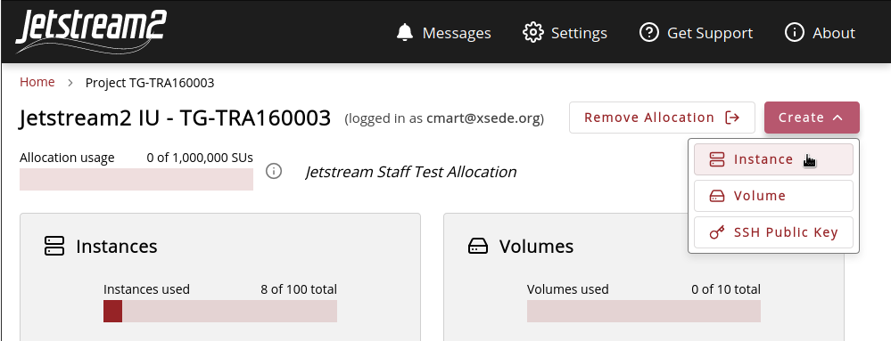
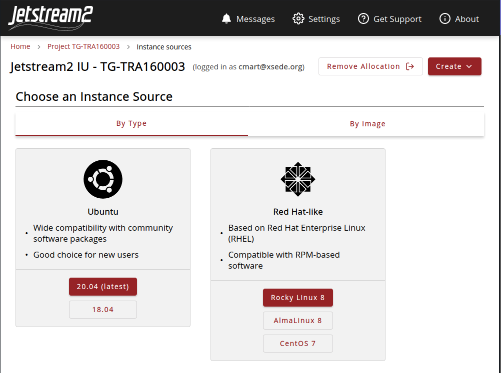
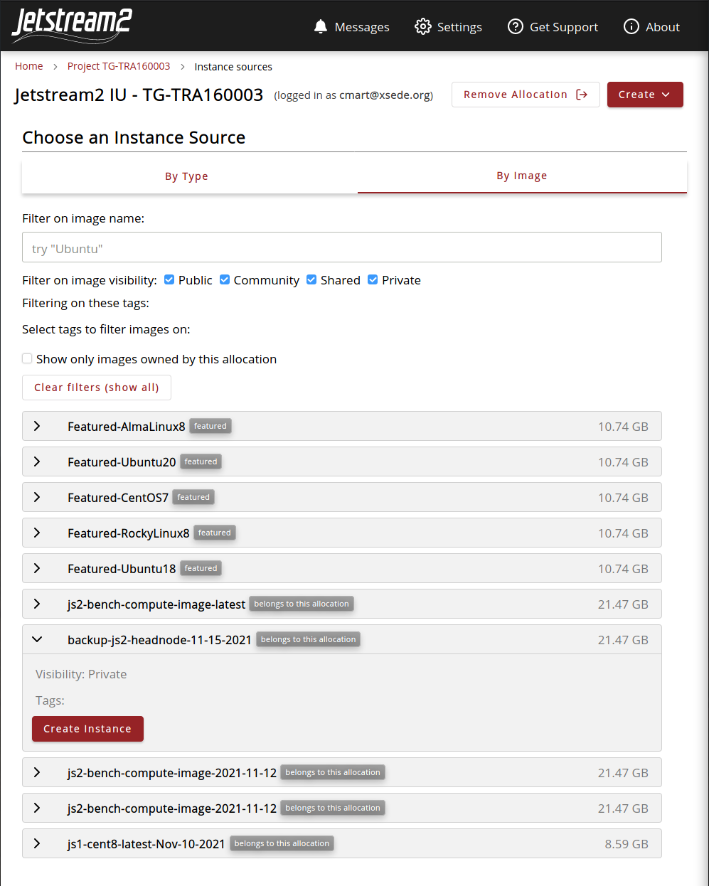
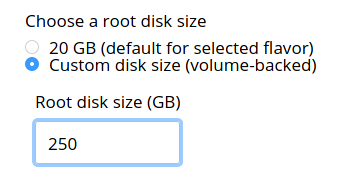

# Creating an Instance with Exosphere

Once you have logged in and selected an allocation, select "Create" and then "Instance".

---

## Choose an Instance Source

Next, choose an instance source. If you are a new user, select your desired operating system "By Type".

### Choosing by Type

When you choose By Type, Exosphere selects the latest official image for you automatically. Select your preferred operating system, or if you don't have one, just pick the newest Ubuntu version.

---

### Choosing by Image

Alternatively, if you want to specify a particular image to create an instance from, select the "By Image" tab. Here, you can browse the entire Jetstream2 image catalog.

---

## Configure Instance

Next, you can select options your new instance. If you're unsure what to choose for any of these, you can leave it at the default. When you're done choosing options, click the "Create" button at the bottom.

---

### Choose a Name

If you will use the instance for anything important, resist the urge to accept the randomly-generated name. Give it a descriptive name to distinguish it from other instances later.

### Choose a Flavor

Exosphere selects the smallest [flavor](../../general/vmsizes.md) by default. This is good for exploring and development work, because it conserves your Jetstream2 allocation.

Select a larger-size flavor if the smallest flavor proves too small for your explorations, or if you are ready to scale a workload up to many CPU cores / many GB of RAM. Note that larger flavors will consume your allocation (SUs) more quickly. Select a GPU flavor if you require a GPU (and your Jetstream2 allocation provides GPU access).

Note that in the near future, Exosphere will allow you to live-resize an instance to another flavor. Until then, if you want to use a different flavor, you must either create a new instance, or submit a support request asking to have your instance resized.

### Choose a Root Disk Size

If the default size for the selected flavor is too small for your needs, you can specify a larger custom disk size. This will create a [volume-backed instance](../../../faq/general-faq/#i-need-a-root-disk-larger-than-the-maximum-size-for-jetstream2-instances-can-you-create-a-custom-flavor-for-me).

### Choose a Quantity

You can create multiple instances simultaneously, up to the maximum quantity your [quota limits](../../faq/alloc.md) support.

When you create multiple instances at a time, and "X of Y" will be appended to the name of each. Otherwise, they will all will receive the same configuration.

---

### Web Desktop

Enable Web Desktop if you need to use graphical software on your instance, or if you prefer working in a graphical environment instead of a text-based shell (terminal). Note that the graphical desktop environment consumes slightly more resources (CPU and RAM) than a shell, so consider using at least the `m3.small` flavor for a more responsive experience.

## Advanced Options

Most people can skip these advanced options, and just click the "Create" button at the bottom. Advanced options are intended for power users and less-common use cases.

### Install Operating System Updates

By default, new instances install operating system security and bug-fix updates when they first power on. This takes a couple of minutes. So, only skip these if you _really_ want the fastest possible setup and you do _not_ care about the security of your instance. This option does not disable [unattended upgrades](https://packages.ubuntu.com/focal/unattended-upgrades), which may still run in the background shortly after your instance powers on.

### Deploy Guacamole for Easy Remote Access

By default, Exosphere instances provide easy remote access via a [Guacamole](https://guacamole.apache.org)-based terminal (Web Shell), and optionally a graphical environment (Web Desktop). If you _don't_ want these for some reason, and you are comfortable using native SSH to connect to your instance, then you can disable setup of the Guacamole components.

### Network

By default, Exosphere will use the network topology that OpenStack automatically creates for your allocation (and ask OpenStack to create it if needed). If you want your instance connected to a different OpenStack network, you can choose that here. If you change this without knowing what you're doing, your instance may end up with broken network connectivity.

### Public IP Address

By default, Exosphere assigns a public (floating) IP address to your instances. Right now, a public IP is _required_ for the Guacamole-based interactions (Web Shell and Desktop) to work. It is also required for you to make a direct native SSH connection to your instance from your workstation (or from anywhere else outside Jetstream2).

Still, you may be creating a cluster of instances, and you may not want all of the cluster nodes to have public IP addresses. In this and similar cases, you can disable the assignment of a public IP address here. If you disable the public IP address for an instance, the only way to connect to that instance will be via native SSH, _from one of your other instances that does have a public IP address_.

### SSH Public Key

If you want to make a native SSH connection to your instance using [public key-based authentication](https://kb.iu.edu/d/aews), you can select your public SSH key here, and upload a new one if needed.

Note that you do not need to use key-based authentication to connect to an instance via native SSH. Regardless of your choice here, Exosphere will also set a strong passphrase for the `exouser` user. You can view this passphrase (and use it to SSH in) after instance setup is complete.

### Boot Script

Here you can see how the sausage is made! The term "boot script" is a slight over-simplification: this text area contains [cloud-init](https://cloudinit.readthedocs.io/en/latest/topics/examples.html) configuration represented in [YAML](https://en.wikipedia.org/wiki/YAML) format, which Exosphere passes to the new instance when it is first powered on.

It is generally best to leave this text area alone, create the instance, then log into it and make further configuration changes as needed (e.g. installing software and downloading data).

Most of what you see here is important for Exosphere's interactions and other features to work with the new instance. So, if you make changes without knowing what you're doing, the instance setup may not complete. This will leave the instance in a partially working, partially broken state from Exosphere's perspective. In this case, Jetstream2 support staff would likely advise you to delete it and create another instance with this field left un-modified.

Still, if you are not afraid of editing YAML, you can modify this configuration before clicking the "Create" button. Note that Exosphere templates out a few important variables which are enclosed in single curly braces (`{` and `}`) in this configuration data.

---

Finally, click the "Create" button at the bottom, and Exosphere will set up your instance.